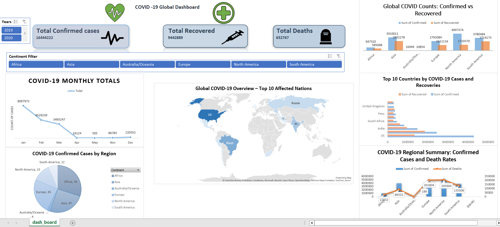

# 🦠 COVID-19 Excel Dashboard
This project is an interactive **Excel-based dashboard** that visualizes the global impact of COVID-19 using pivot charts, slicers, and maps. It allows users to explore trends in confirmed cases, recoveries, and deaths across different continents and countries.

## 📊 Dashboard Overview

- ✅ **Total Confirmed Cases:** 16,444,222  
- 💉 **Total Recovered:** 9,442,889  
- ⚰️ **Total Deaths:** 652,767  

### Dashboard Features:
- Monthly breakdown of cases
- Regional summary by continent
- Top 10 affected countries
- Interactive filters by year and continent
- Pivot charts: bar, line, and combo
- World map view for major hotspots

## 📈 Key Visuals

### 🌍 Global COVID Counts: Confirmed vs Recovered

This clustered chart compares the total number of confirmed and recovered cases across continents, giving a visual representation of recovery progress relative to spread.

### 📊 COVID-19 Dashboard: Top 10 Countries by Cases and Recoveries

A visually rich dashboard showcasing the top 10 countries most affected by COVID-19, comparing confirmed cases and recoveries. Built using Python and pandas, this project highlights data storytelling through charts and clean design.

### 📊 COVID-19 Cases by Continent – Pie Chart Visualizatio

A clean and intuitive pie chart showing the distribution of confirmed COVID-19 cases across six continents. Built using Python and matplotlib, this visualization offers a quick glance at regional impact and global case proportions.

### 📈 COVID-19 Regional Summary – Confirmed Cases vs. Death Rate

A dual-axis chart comparing confirmed COVID-19 cases (bar graph) and death rates (line graph) across six continents. Built using Python, this visualization highlights regional disparities and offers a clear overview of pandemic severity.

## 🚀 How to Use

1. Download and open `Covid_19 Dashboard.xlsx` in Microsoft Excel.
2. Use the slicers (Year, Continent) to explore the data dynamically.
3. Navigate through different visuals and summaries in the dashboard.

## 📁 Project Structure

| File                             | Description                                 |
|----------------------------------|---------------------------------------------|
| `Covid_19 Dashboard.xlsx`        | Final interactive Excel dashboard           |
| `MINI PROJECT DATASET.xlsx`      | Raw dataset used to build dashboard         |
| `Resources/Image/*.png`          | Dashboard screenshots and pivot chart visuals |
| `README.md`                      | Project documentation                       |

## 🎯 Project Objective

To build a fully functional, no-code data dashboard using Excel that visually communicates key COVID-19 trends, suitable for stakeholders with minimal technical background.

## 📌 Insights (Optional)

- North America recorded the highest confirmed cases.
- Recovery rates varied drastically between regions.
- Death rates were significantly high in South America and Europe.
- Africa had relatively fewer confirmed and death cases.
   
## 🧰 Tools & Skills Used

- Microsoft Excel  
- Pivot Tables  
- Pivot Charts  
- Slicers  
- Interactive Filters  
- Map Visualization

## ✍️ Author

**Mohit Kumar Singh**  
Aspiring Data Analyst | Excel | Python | Statistics  

[GitHub Profile](https://github.com/your-username)  
